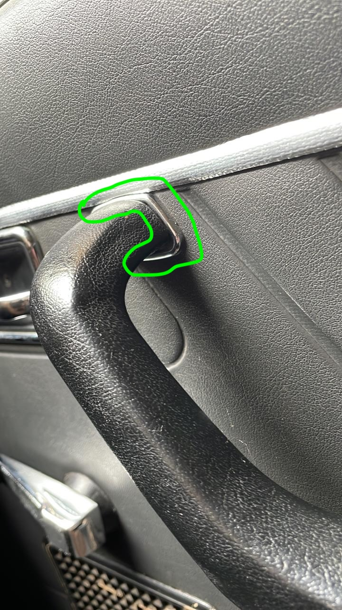
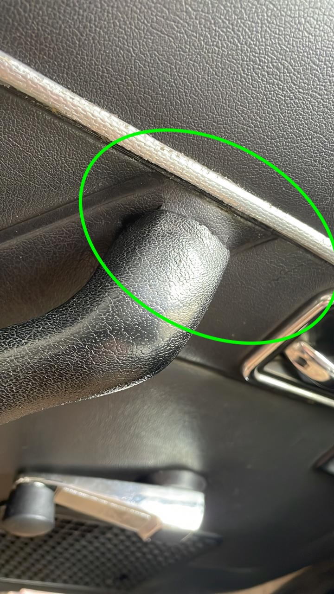
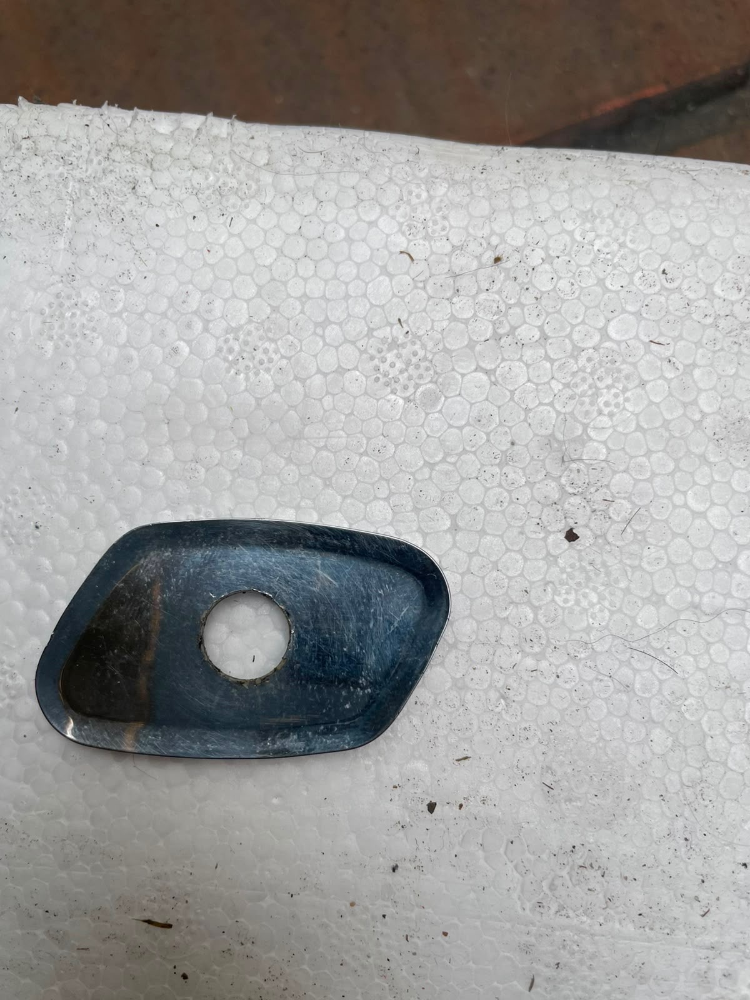
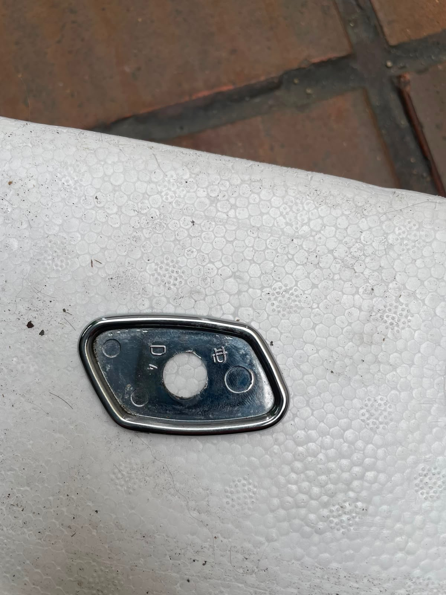
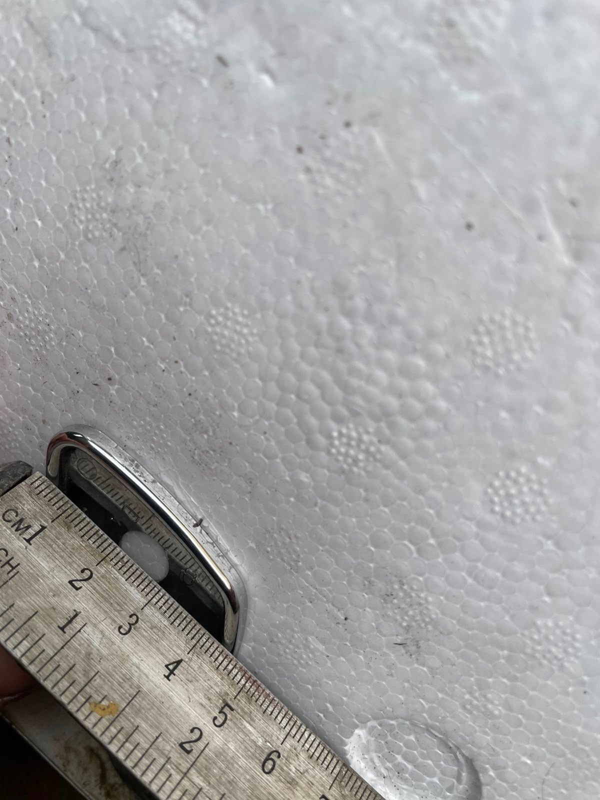

# 1985 Renault 18 – Armrest Detail (3D Printable Model)

This project is an attempt to create a 3D-printable replacement part for a small detail in the armrest of a **1985 Renault 18**.

The original part is no longer available, so the goal is to reverse-engineer the shape from reference photos and measurements, model it in OpenSCAD, and export an STL file suitable for FDM or resin 3D printing.

## Status

🚧 **Still in development** – the model is a work in progress. Dimensions and fit are being refined through test prints and comparison with the original component.

## Files

- `design.scad` – OpenSCAD source file for the armrest detail.
- `Main.stl` – Exported STL ready for slicing/printing.
- `reference_images/` – Photos of the original part and the car interior used as modeling references.
- `r_and_d_archive/` – Earlier prototypes, test prints, and alternate design iterations.

## Reference Images

Below are a few reference photos showing the armrest area and the detail being replicated:

## How to Generate an STL

You can open `design.scad` in [OpenSCAD](https://openscad.org/) and render/export an STL, or use a service like [Ochafik's online OpenSCAD renderer](https://ochafik.com/) to generate an STL file for printing if needed.

## License

This project is shared for personal/educational use. Print and modify at your own risk.